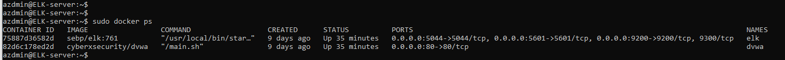

## Automated ELK Stack Deployment

The files in this repository were used to configure the network depicted below.

.png)

These files have been tested and used to generate a live ELK deployment on Azure. They can be used to either recreate the entire deployment pictured above. Alternatively, select portions of the yml file may be used to install only certain pieces of it, such as Filebeat.

  - ELKserverplaybook.yml: This playbook can be used to setup the ELK server.
  - Filebeat-playbook.yml: This playbook can be used to setup Filebeat on the WebVMs.
  - Metricsbeat-playbook.yml: This playbook can be used to setup Metricbeat on the WebVMs.

This document contains the following details:
- Description of the Topologu
- Access Policies
- ELK Configuration
  - Beats in Use
  - Machines Being Monitored
- How to Use the Ansible Build

### Description of the Topology

The main purpose of this network is to expose a load-balanced and monitored instance of DVWA, the D*mn Vulnerable Web Application.

Load balancing ensures that the application will be highly available, in addition to restricting access to the network.
- The load balancers used in this project only allow HTTP traffic on port 80 to the DVWA servers. The load balancer chooses and sends web traffic to a Web VM among the list of VMs managed by Load balncer. In the event the serving VM was not go down for any reason, the load balancer switches the traffic to another web server that is in the list.

Integrating an ELK server allows users to easily monitor the vulnerable VMs for changes to the log and system files.
- Filebeat is used to monitor all system logs and chages to system files on the Vulnerable VMs.
- Metricbeat is used to send system KPIs, like disk space, CPU utilization, and list of running processes on the Vulnerable VMs.

The configuration details of each machine may be found below.

| Name       | Function                   | IP Address | Operating System |
|------------|----------------------------|------------|------------------|
| Jump Box   | Gateway                    | 10.0.0.10  | Linux            |
| Web 1      | Vulnerable Web Application | 10.0.0.11  | Linux            |
| Web 2      | Vulnerable Web Application | 10.0.0.9   | Linux            |
| Web 3      | Vulnerable Web Application | 10.0.0.12  | Linux            |
| ELK Server | Web Application Monitoring | 10.1.0.4   | Linux            |

### Access Policies

The machines on the internal network are not exposed to the public Internet. 

Only the Jump Box machine can accept connections from the Internet. Access to this machine is only allowed from the following IP addresses:
- 96.241.114.247

Machines within the network can only be accessed by the Jump box Machine.
- Jump Box Machine can access the ELK server by the anseible container. The IP address of the ELK server is 10.1.0.4.

A summary of the access policies in place can be found in the table below.

| Name       | Publicly Accessible                                        |             Allowed IP addresses             |
|------------|------------------------------------------------------------|:--------------------------------------------:|
| Jump Box   | Yes (Only by the white listed IP Address 96.241.114.247)   |                 138.91.241.57                |
| Web 1      |                             No                             |  10.1.0.4 - 10.0.0.10 - 10.0.0.9 - 10.0.0.12 |
| Web 2      |                             No                             | 10.1.0.4 - 10.0.0.10 - 10.0.0.11 - 10.0.0.12 |
| Web 3      |                             No                             |  10.1.0.4 - 10.0.0.10 - 10.0.0.9 - 10.0.0.11 |
| ELK Server |                             No                             | 10.0.0.10 - 10.0.0.9 - 10.0.0.12 - 10.0.0.11 |

### Elk Configuration

Ansible was used to automate configuration of the ELK machine. No configuration was performed manually, which is advantageous because...
- It could be time consuming to edit each of the files on the ELK configuration files, and also, this allows faster scalabilty in which we can use the same playbook to deploy multiple ELK servers using the same playbook configuration. 

The playbook implements the following tasks:
- Install Docker
- Allow the server to use more memory
- Download and Launch a Docker ELK container
- Enable service docker on boot

The following screenshot displays the result of running `docker ps` after successfully configuring the ELK instance.

### Target Machines & Beats
This ELK server is configured to monitor the following machines:
- Web 1 - 10.0.0.11
- Web 2 - 10.0.0.9
- Web 3 - 10.0.0.12

We have installed the following Beats on these machines:
- Web 1 - filebeat-7.4.0-amd64.deb
- Web 2 - filebeat-7.4.0-amd64.deb
- Web 3 - filebeat-7.4.0-amd64.deb

These Beats allow us to collect the following information from each machine:
- Filebeats allows us to monitor file logs and collect log events. Example of such logs is login attempts.
- Metribeats records metrics and statics. Example is the CPU utilization. 

### Using the Playbook
In order to use the playbook, you will need to have an Ansible control node already configured. Assuming you have such a control node provisioned: 

SSH into the control node and follow the steps below:
- Copy the filebeat.yml file to /etc/ansbile.
- Update the filebeat-conig.yml file to include ELK server IP address, name, credetionals, state, and ports.
- Run the playbook, and navigate to ELK server to check that the installation worked as expected.

- Filebeat-playbook.yml contains the ansible playbook, copy this file to /etc/ansible/.
- Configure the Hosts file on /etc/ansible to include the Elk servers IP and Webservers IPs. The Filebeat-playbook.yml playbook will run and configure the Webservers only.
- http://52.138.3.119:5601

